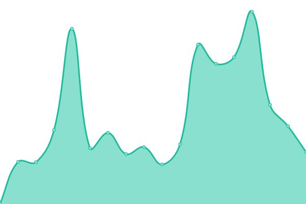
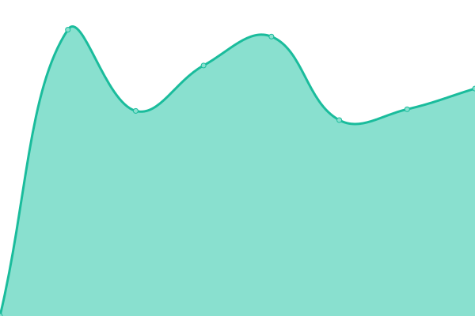
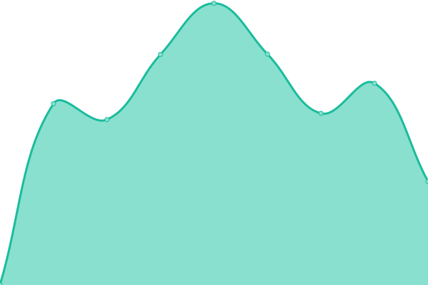

# [📈 Live Status](https://merakioffice.github.io/mensores-status): <!--live status--> **🟩 All systems operational**

This repository contains the open-source uptime monitor and status page for [merakioffice](https://merakioffice.github.io/mensores-status), powered by [Upptime](https://github.com/upptime/upptime).

With [Upptime](https://upptime.js.org), you can get your own unlimited and free uptime monitor and status page, powered entirely by a GitHub repository. We use [Issues](https://github.com/merakioffice/mensores-status/issues) as incident reports, [Actions](https://github.com/merakioffice/mensores-status/actions) as uptime monitors, and [Pages](https://merakioffice.github.io/mensores-status) for the status page.

<!--start: status pages-->
<!-- This summary is generated by Upptime (https://github.com/upptime/upptime) -->
<!-- Do not edit this manually, your changes will be overwritten -->
<!-- prettier-ignore -->
| URL | Status | History | Response Time | Uptime |
| --- | ------ | ------- | ------------- | ------ |
|  [[QA] Globalfinder](https://qa.globalfinder.com.ar) | 🟩 Up | [qa-globalfinder.yml](https://github.com/merakioffice/mensores-status/commits/HEAD/history/qa-globalfinder.yml) | 

 325ms
     
 | 

<a href="https://merakioffice.github.io/mensores-status/history/qa-globalfinder">99.35%</a>
    

|  [[QA] Pmsubeescaleras](https://qa.pmsubeescaleras.com.ar) | 🟩 Up | [qa-pmsubeescaleras.yml](https://github.com/merakioffice/mensores-status/commits/HEAD/history/qa-pmsubeescaleras.yml) | 

 3712ms
     
 | 

<a href="https://merakioffice.github.io/mensores-status/history/qa-pmsubeescaleras">84.99%</a>
    

|  [[QA] IF-Colombia](https://qa.ifc.mensorestudio.com) | 🟩 Up | [qa-if-colombia.yml](https://github.com/merakioffice/mensores-status/commits/HEAD/history/qa-if-colombia.yml) | 

 499ms
     
 | 

<a href="https://merakioffice.github.io/mensores-status/history/qa-if-colombia">100.00%</a>
    

|  [[QA] Mensorestudio](https://qa2.mensorestudio.com) | 🟩 Up | [qa-mensorestudio.yml](https://github.com/merakioffice/mensores-status/commits/HEAD/history/qa-mensorestudio.yml) | 

 629ms
     
 | 

<a href="https://merakioffice.github.io/mensores-status/history/qa-mensorestudio">100.00%</a>
    

|  [[QA] Mensorestudio ARG](https://qa2.mensorestudio.com.ar) | 🟩 Up | [qa-mensorestudio-arg.yml](https://github.com/merakioffice/mensores-status/commits/HEAD/history/qa-mensorestudio-arg.yml) | 

 731ms
     
 | 

<a href="https://merakioffice.github.io/mensores-status/history/qa-mensorestudio-arg">100.00%</a>
    

|  [[QA] Ortopedia Suiza](https://qa.ortopediasuiza.com.ar/) | 🟩 Up | [qa-ortopedia-suiza.yml](https://github.com/merakioffice/mensores-status/commits/HEAD/history/qa-ortopedia-suiza.yml) | 

 1372ms
     
 | 

<a href="https://merakioffice.github.io/mensores-status/history/qa-ortopedia-suiza">100.00%</a>
    

<!--end: status pages-->

[**Visit our status website →**](https://merakioffice.github.io/mensores-status)

## 📄 License

- Powered by: [Upptime](https://github.com/upptime/upptime)
- Code: [MIT](./LICENSE) © [Anand Chowdhary](https://anandchowdhary.com), supported by [Pabio](https://pabio.com)
- Data in the `./history` directory: [Open Database License](https://opendatacommons.org/licenses/odbl/1-0/)
