# [📈 Live Status](https://merakioffice.github.io/mensores-status): <!--live status--> **🟧 Partial outage**

This repository contains the open-source uptime monitor and status page for [merakioffice](https://merakioffice.github.io/mensores-status), powered by [Upptime](https://github.com/upptime/upptime).

With [Upptime](https://upptime.js.org), you can get your own unlimited and free uptime monitor and status page, powered entirely by a GitHub repository. We use [Issues](https://github.com/merakioffice/mensores-status/issues) as incident reports, [Actions](https://github.com/merakioffice/mensores-status/actions) as uptime monitors, and [Pages](https://merakioffice.github.io/mensores-status) for the status page.

<!--start: status pages-->
<!-- This summary is generated by Upptime (https://github.com/upptime/upptime) -->
<!-- Do not edit this manually, your changes will be overwritten -->
<!-- prettier-ignore -->
| URL | Status | History | Response Time | Uptime |
| --- | ------ | ------- | ------------- | ------ |
|  [Globalfinder](https://globalfinder.com.ar) | 🟩 Up | [globalfinder.yml](https://github.com/merakioffice/mensores-status/commits/HEAD/history/globalfinder.yml) | 

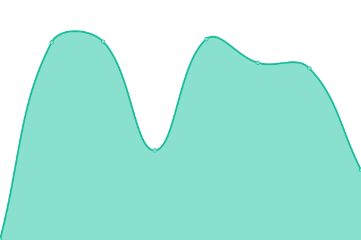 350ms
     
 | 

<a href="https://merakioffice.github.io/mensores-status/history/globalfinder">100.00%</a>
    

|  [Pmsubeescaleras](https://pmsubeescaleras.com.ar) | 🟩 Up | [pmsubeescaleras.yml](https://github.com/merakioffice/mensores-status/commits/HEAD/history/pmsubeescaleras.yml) | 

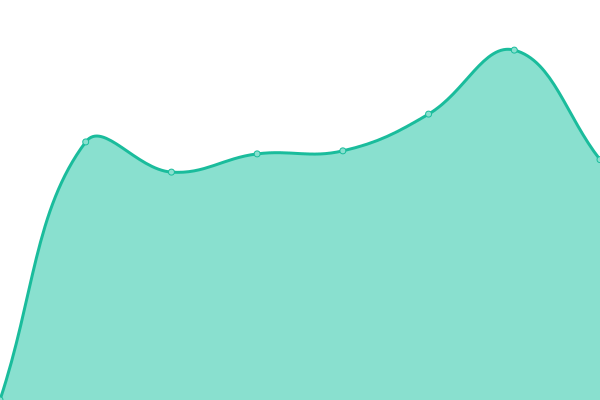 3847ms
     
 | 

<a href="https://merakioffice.github.io/mensores-status/history/pmsubeescaleras">99.33%</a>
    

|  [[QA] IF-Colombia](https://qa.ifcolombie.mensorestudio.com/) | 🟩 Up | [qa-if-colombia.yml](https://github.com/merakioffice/mensores-status/commits/HEAD/history/qa-if-colombia.yml) | 

 1407ms
     
 | 

<a href="https://merakioffice.github.io/mensores-status/history/qa-if-colombia">100.00%</a>
    

|  [Mensorestudio](https://mensorestudio.com) | 🟩 Up | [mensorestudio.yml](https://github.com/merakioffice/mensores-status/commits/HEAD/history/mensorestudio.yml) | 

 836ms
     
 | 

<a href="https://merakioffice.github.io/mensores-status/history/mensorestudio">100.00%</a>
    

|  [Mensorestudio ARG](https://mensorestudio.com.ar) | 🟩 Up | [mensorestudio-arg.yml](https://github.com/merakioffice/mensores-status/commits/HEAD/history/mensorestudio-arg.yml) | 

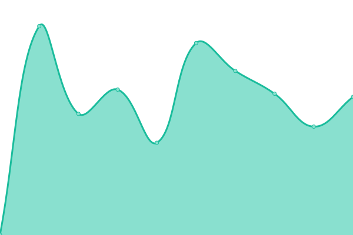 835ms
     
 | 

<a href="https://merakioffice.github.io/mensores-status/history/mensorestudio-arg">100.00%</a>
    

|  [[PROD] Hidalgo & Asociados](https://hidalgoyasociados.com.ar/) | 🟩 Up | [prod-hidalgo-and-asociados.yml](https://github.com/merakioffice/mensores-status/commits/HEAD/history/prod-hidalgo-and-asociados.yml) | 

 1102ms
     
 | 

<a href="https://merakioffice.github.io/mensores-status/history/prod-hidalgo-and-asociados">100.00%</a>
    

|  [capaccioli](https://www.capaccioli-sa.com.ar) | 🟩 Up | [capaccioli.yml](https://github.com/merakioffice/mensores-status/commits/HEAD/history/capaccioli.yml) | 

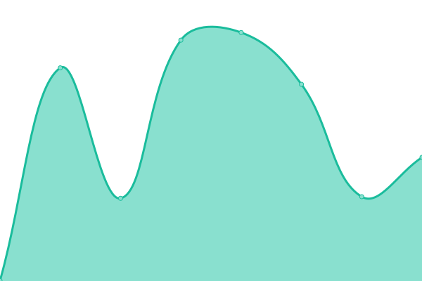 318ms
     
 | 

<a href="https://merakioffice.github.io/mensores-status/history/capaccioli">0.00%</a>
    

|  [Ecosud](https://qa.ecosud.mensorestudio.com.ar/) | 🟩 Up | [ecosud.yml](https://github.com/merakioffice/mensores-status/commits/HEAD/history/ecosud.yml) | 

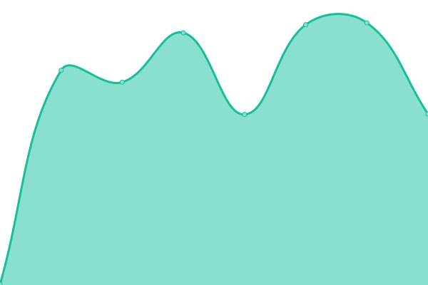 465ms
     
 | 

<a href="https://merakioffice.github.io/mensores-status/history/ecosud">0.00%</a>
    

|  [Decoacuarios](https://decoacuarios.com.ar/) | 🟩 Up | [decoacuarios.yml](https://github.com/merakioffice/mensores-status/commits/HEAD/history/decoacuarios.yml) | 

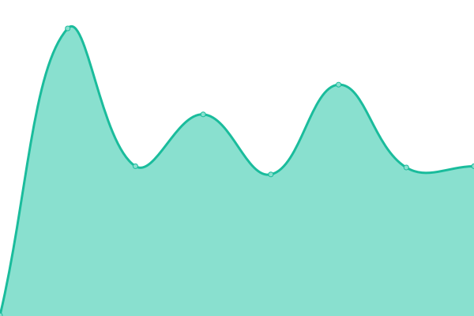 294ms
     
 | 

<a href="https://merakioffice.github.io/mensores-status/history/decoacuarios">0.00%</a>
    

|  [Signouniformes](https://signouniformes.com/) | 🟩 Up | [signouniformes.yml](https://github.com/merakioffice/mensores-status/commits/HEAD/history/signouniformes.yml) | 

 1041ms
     
 | 

<a href="https://merakioffice.github.io/mensores-status/history/signouniformes">0.00%</a>
    

|  [Ortopediasuiza](https://ortopediasuiza.com.ar/) | 🟩 Up | [ortopediasuiza.yml](https://github.com/merakioffice/mensores-status/commits/HEAD/history/ortopediasuiza.yml) | 

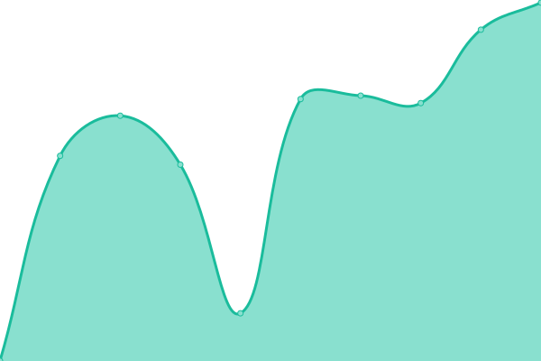 1196ms
     
 | 

<a href="https://merakioffice.github.io/mensores-status/history/ortopediasuiza">100.00%</a>
    

|  [Sibaritta](https://sibaritta.com/) | 🟥 Down | [sibaritta.yml](https://github.com/merakioffice/mensores-status/commits/HEAD/history/sibaritta.yml) | 

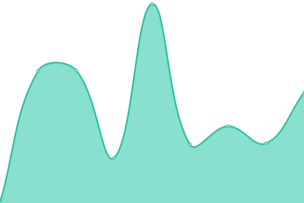 0ms
     
 | 

<a href="https://merakioffice.github.io/mensores-status/history/sibaritta">0.00%</a>
    

|  [Aatalac](https://aatalac.org.ar/) | 🟩 Up | [aatalac.yml](https://github.com/merakioffice/mensores-status/commits/HEAD/history/aatalac.yml) | 

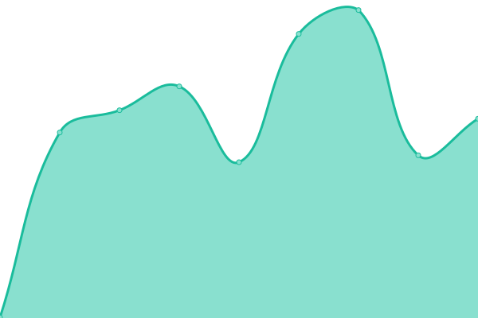 2311ms
     
 | 

<a href="https://merakioffice.github.io/mensores-status/history/aatalac">99.93%</a>
    

|  [Ifcolombie.fr](https://ifcolombie.fr/) | 🟩 Up | [ifcolombie-fr.yml](https://github.com/merakioffice/mensores-status/commits/HEAD/history/ifcolombie-fr.yml) | 

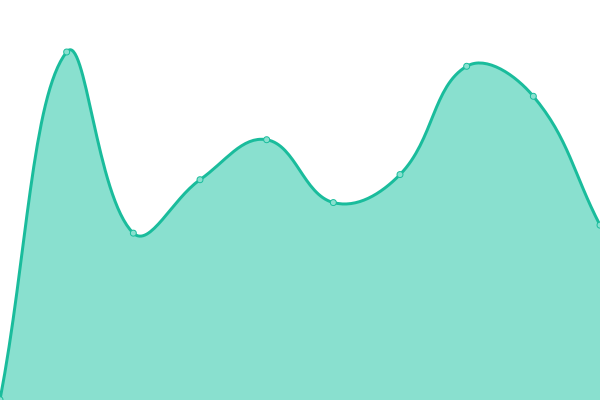 791ms
     
 | 

<a href="https://merakioffice.github.io/mensores-status/history/ifcolombie-fr">0.00%</a>
    

|  [Ifcolombie.fr IMAGE](https://ifcolombie.fr/storage/img/1744271168.jpeg) | 🟩 Up | [ifcolombie-fr-image.yml](https://github.com/merakioffice/mensores-status/commits/HEAD/history/ifcolombie-fr-image.yml) | 

 36ms
     
 | 

<a href="https://merakioffice.github.io/mensores-status/history/ifcolombie-fr-image">0.00%</a>
    

|  [Ifargentine](https://ifargentine.com.ar/) | 🟩 Up | [ifargentine.yml](https://github.com/merakioffice/mensores-status/commits/HEAD/history/ifargentine.yml) | 

 644ms
     
 | 

<a href="https://merakioffice.github.io/mensores-status/history/ifargentine">96.95%</a>
    

|  [Jardin Japones](https://jardinjapones.org.ar/) | 🟩 Up | [jardin-japones.yml](https://github.com/merakioffice/mensores-status/commits/HEAD/history/jardin-japones.yml) | 

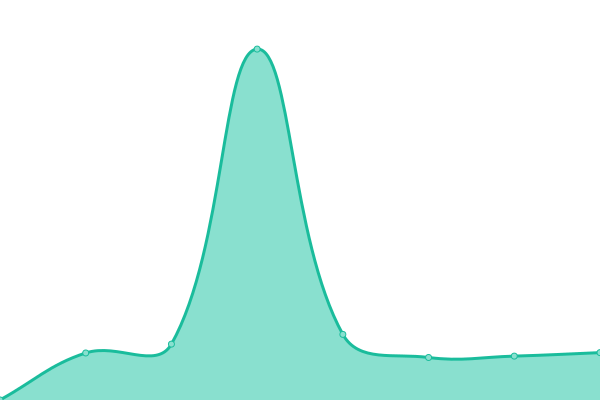 852ms
     
 | 

<a href="https://merakioffice.github.io/mensores-status/history/jardin-japones">100.00%</a>
    

|  [Mercadomeet](https://mercadomeet.com.co/) | 🟩 Up | [mercadomeet.yml](https://github.com/merakioffice/mensores-status/commits/HEAD/history/mercadomeet.yml) | 

 310ms
     
 | 

<a href="https://merakioffice.github.io/mensores-status/history/mercadomeet">100.00%</a>
    

|  [Cines Virtual](https://www.cinevirtual.com.ar) | 🟩 Up | [cines-virtual.yml](https://github.com/merakioffice/mensores-status/commits/HEAD/history/cines-virtual.yml) | 

 574ms
     
 | 

<a href="https://merakioffice.github.io/mensores-status/history/cines-virtual">100.00%</a>
    

<!--end: status pages-->

[**Visit our status website →**](https://merakioffice.github.io/mensores-status)

## 📄 License

- Powered by: [Upptime](https://github.com/upptime/upptime)
- Code: [MIT](./LICENSE) © [Anand Chowdhary](https://anandchowdhary.com), supported by [Pabio](https://pabio.com)
- Data in the `./history` directory: [Open Database License](https://opendatacommons.org/licenses/odbl/1-0/)
